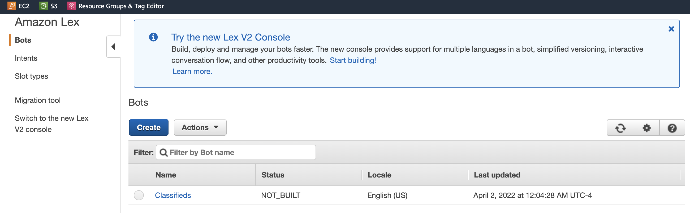
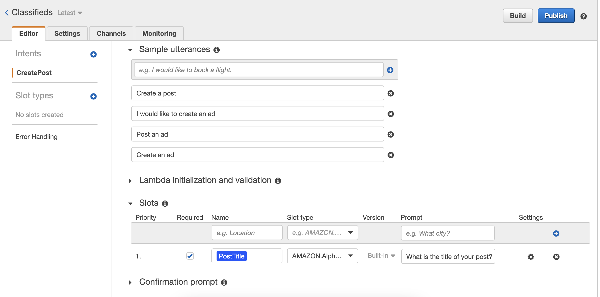
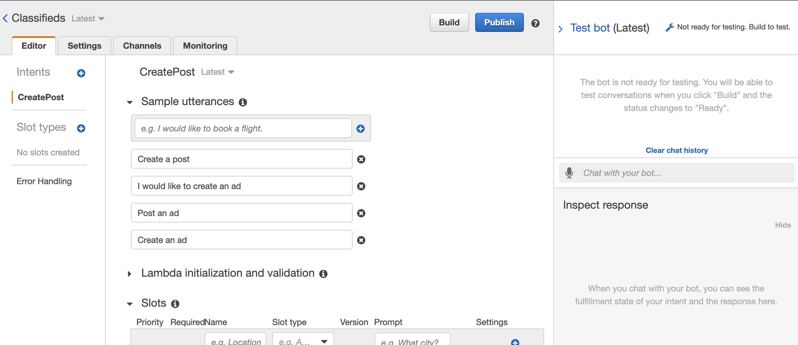
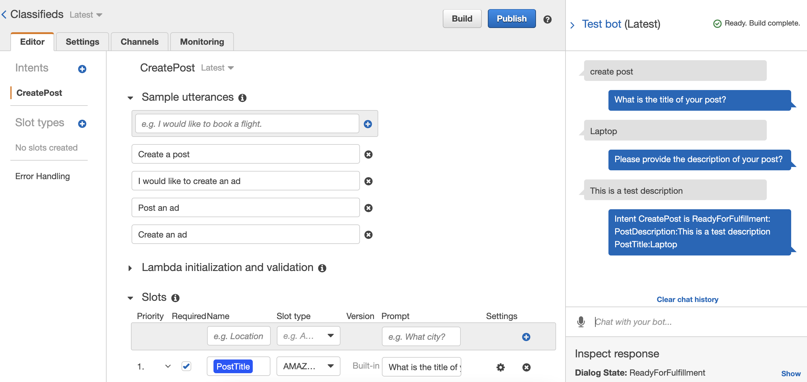
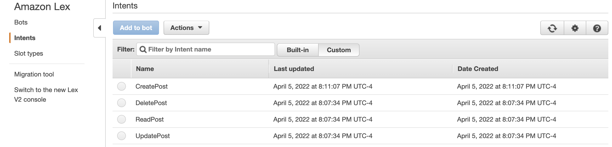
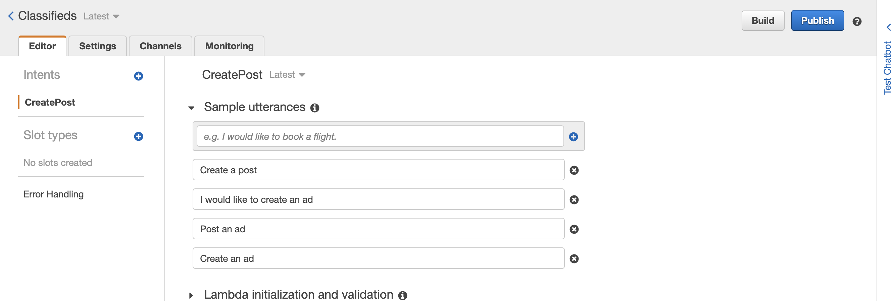
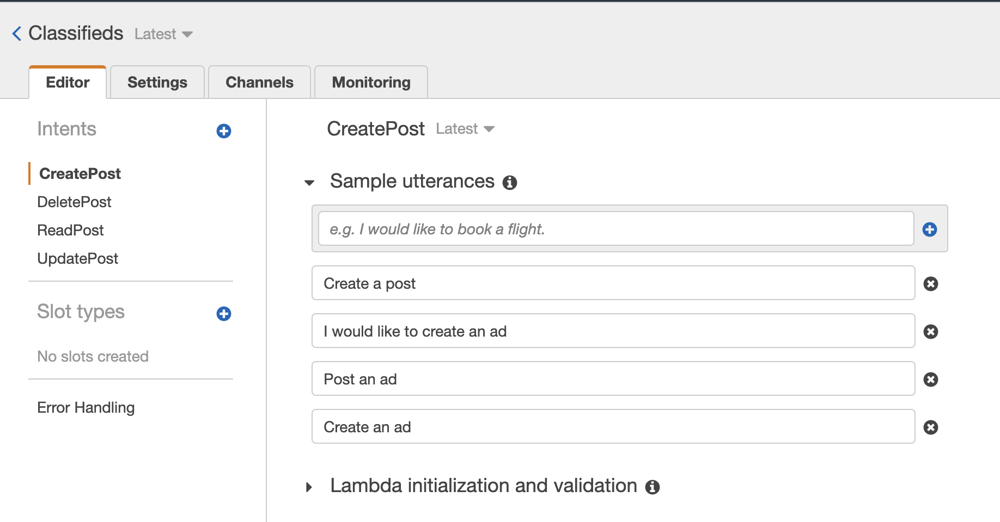

# Chatbot Creation

## Introducing Amazon Lex

For our chatbot, we are going to use Amazon Lex. Amazon Lex is an AWS service for building conversational interfaces for voice and text applications. It is the same conversational engine that powers Amazon Alexa. This engine affords us with deep functionality of natural language understanding (NLU) and automatic speech recognition (ASR).

Terraform official providers are well documented. For example, for Amazon Lex, we can check https://registry.terraform.io/providers/hashicorp/aws/latest/docs/resources/lex_bot for usage and all the required documents.

Create a new file `lex.tf` within your `aws-terraform-by-example` directory and add the following block.

```hcl
# Create our lex bot
resource "aws_lex_bot" "classifieds" {
  name           = "Classifieds"
  child_directed = false

  abort_statement {
    message {
      content_type = "PlainText"
      content      = "Sorry, I am not able to assist you at this time"
    }
  }
}
```

The nice thing about Terraform is that it allows you to perform a dry run which lets you preview the changes Terraform plans to make to your infrastructure. You can do so by running the following command.

```bash
$ terraform plan
```

Running the plan command, you should expect an error similar to below

```text
╷
│ Error: Insufficient intent blocks
│
│   on lex.tf line 1, in resource "aws_lex_bot" "classifieds":
│    1: resource "aws_lex_bot" "classifieds" {
│
│ At least 1 "intent" blocks are required.
```

I intentionally omitted some required arguments to show that Terraform will perform necessary validations on the resources we intend to create, so let's fix that. Amazon Lex requires us to define at least an intent (goal) for our users that use the bots. Lex will use a specific intent to engage a user in a conversation to elicit information and fulfill the user's intent/goal. For example, a user can have an intent to book a flight, order flowers, etc. It's worth noting that a single bot can have multiple different intents.

Our bot is going to contain four intents to start. The intents will be as follows:

**CreatePost**
The user intents to create a new post.

**ReadPost**
The user intents to read/view a post.

**UpdatePost**
The user intents to update a post that they own.

**DeletePost**
The user intents to delete a post that they own.

Let's start with the `CreatePost` intent. Update the file `lex.tf` to the following.

```hcl{13-17,19-100}
// Create our lex bot
resource "aws_lex_bot" "classifieds" {
  name           = "Classifieds"
  child_directed = false

  abort_statement {
    message {
      content_type = "PlainText"
      content      = "Sorry, I am not able to assist you at this time"
    }
  }

  // CreatePost intent block
  intent {
    intent_name    = aws_lex_intent.create_post.name
    intent_version = aws_lex_intent.create_post.version
  }
}

#  Intents - These are actions that the user wants to perfom
resource "aws_lex_intent" "create_post" {

# this is the final state of the intent, normally with a closing message and some
# additional information for the user; e.g. for a flight booking you could confirm that
# the flight is booked, along with a brief summary of the route
# and the flight number that the user has been booked onto
  fulfillment_activity {
    type = "ReturnIntent"
  }

  name = "CreatePost"

  # Utterances - textual representations of what a user
  # has to type or say in order to trigger an intent.
  # An intent can contain many different utterances, allowing users
  # to trigger the bot using different phrases
  sample_utterances = [
    "Create a post",
    "I would like to create an ad",
    "Create an ad",
    "Post an ad"
  ]

  # Slots -  these are the data items that the bot intent needs in order to be able
  # to fulfill its task; e.g. for ordering flowers intent you will likely
  # need slots for type of flowers, delivery date,
  # and personal message to receipient to include.
  slot {
    name        = "PostTitle"
    description = "The title for your post / ad"
    priority    = 1

    slot_constraint = "Required"

    #  Amazon Lex has several built-in slot types, but you can
    # create your own custom slot types depending on use case
    slot_type = "AMAZON.AlphaNumeric"

    value_elicitation_prompt {
      max_attempts = 2

      message {
        content      = "What is the title of your post?"
        content_type = "PlainText"
      }
    }
  }
}
```

Run `terraform plan` command again, and you should see an output that says two resources will be created. Since we are happy with the plan, let's go ahead and create the resources by running the `apply` command. You will get a chance to confirm resource creation.

```bash
$ terraform apply
```

Once you confirm, you should expect output similar to below.

```txt
Plan: 2 to add, 0 to change, 0 to destroy.

Do you want to perform these actions?
  Terraform will perform the actions described above.
  Only 'yes' will be accepted to approve.

  Enter a value: yes

aws_lex_intent.create_post: Creating...
aws_lex_intent.create_post: Creation complete after 0s [id=CreatePost]
aws_lex_bot.classifieds: Creating...
aws_lex_bot.classifieds: Creation complete after 1s [id=Classifieds]
```

Now, if you navigate to your AWS console and search for "Lex," you will notice that a bot was created.



You will also notice the `CreatePost` intent if you click on the bot.



You can run ' terraform destroy' to clean up and delete all resources when done. For example, let's run the destroy command and make it a habit to avoid incurring AWS costs on test environments. Once you run the command, you will see the following output.

```txt
Plan: 0 to add, 0 to change, 2 to destroy.

Do you really want to destroy all resources?
  Terraform will destroy all your managed infrastructure, as shown above.
  There is no undo. Only 'yes' will be accepted to confirm.

  Enter a value: yes

aws_lex_bot.classifieds: Destroying... [id=Classifieds]
aws_lex_bot.classifieds: Destruction complete after 1s
aws_lex_intent.create_post: Destroying... [id=CreatePost]
aws_lex_intent.create_post: Destruction complete after 1s

Destroy complete! Resources: 2 destroyed.
```

# Re-organizing Terraform files

Before we move on to creating other intents, you will notice that our `lex.tf` can potentially grow to a size we can not easily manage. The nice thing about Terraform is related resource declarations don't have to be in the same file. So let's create a file to add our bot intents.

Create a new file `lex_intents.tf` within your `aws-terraform-by-example` directory. We are going to move the `resource "aws_lex_intent" "create_post"` from `lex.tf` to `lex_intents.tf`.

```hcl
#  Intents - These are actions that the user wants to perform
resource "aws_lex_intent" "create_post" {

  # this is the final state of the intent, normally with a closing message and
  # some additional information for the user; e.g. for a flight booking
  # you could confirm that the? flight is booked, along
  # with a summary of the route
  # and the flight number that the user has been booked onto
  fulfillment_activity {
    type = "ReturnIntent"
  }

  name = "CreatePost"

  # Utterances - textual representations of what a user
  # has to type or say to trigger an intent.
  # An intent can contain many different utterances,
  # allowing users to trigger the bot using different phrases
  sample_utterances = [
    "Create a post",
    "I would like to create an ad",
    "Create an ad",
    "Post an ad"
  ]

  # Slots -  these are the data items that the bot intent needs
  # in order to be able to fulfill its task;
  # e.g. for ordering flowers intent you will likely
  # need slots for type of flowers, delivery date,
  # and personal message to receipient to include.
  slot {
    name        = "PostTitle"
    description = "The title for your post / ad"
    priority    = 1

    slot_constraint = "Required"

    # Amazon Lex has several built-in slot types,
    # but you can create your own custom slot types depending on use case
    slot_type = "AMAZON.AlphaNumeric"

    value_elicitation_prompt {
      max_attempts = 2

      message {
        content      = "What is the title of your post?"
        content_type = "PlainText"
      }
    }
  }
}
```

Your `lex.tf` should now look as follows.

```hcl
// Create our lex bot
resource "aws_lex_bot" "classifieds" {
  name           = "Classifieds"
  child_directed = false

  abort_statement {
    message {
      content_type = "PlainText"
      content      = "Sorry, I am not able to assist you at this time"
    }
  }

  // CreatePost intent block
  intent {
    intent_name    = aws_lex_intent.create_post.name
    intent_version = aws_lex_intent.create_post.version
  }
}
```

If you run `terraform apply` again, your resources will be created again. Now that we have specified a location for our intents, let's go ahead and add additional requirements to CreatePost intent and make the rest of the intents.

## Bot intents

### CreatePost intent

Earlier, we created a `CreatePost` intent and specified `PostTitle` slot. Remember, slots are data items that the bot intent needs in order to be able to fulfill its task. For post creation in our app, we need to know the title and description at a minimum. We will talk about additional items like images later on.

Go ahead and add `PostDescription` slot to the `CreatePost` intent. You can add it below the `PostTitle` slot as shown below.

```hcl
  // ...
    slot {
    name        = "PostTitle"
    // ...
  }

  slot {
    name        = "PostDescription"
    description = "The description for your post / ad"
    priority    = 2

    slot_constraint = "Required"
    slot_type       = "AMAZON.AlphaNumeric"

    value_elicitation_prompt {
      max_attempts = 2

      message {
        content      = "Please provide the description of your post?"
        content_type = "PlainText"
      }
    }
  }
  // ...
```

### Test the bot

Run `terraform apply` to re-create the resources.

Amazon Lex provides a Test Bot window to test our changes quickly. However, if you navigate to the bot in the console, you will notice that the input for the Test Bot window is disabled because Lex bot needs to be built before we can test.



In our case, we don't want to keep manually building the bot when we apply Terraform changes. To automatically build the bot, we need to update `lex.tf` as follows.

```hcl
// Create our lex bot
resource "aws_lex_bot" "classifieds" {
  name             = "Classifieds"
  child_directed   = false
  process_behavior = "BUILD" // build the bot so that it can be run
  // ...
}
```

We have added `process_behavior` element. Amazon Lex will build the bot so that it can be run. If you set the value to `SAVE`, which is also the default value, Amazon Lex saves the bot but doesn't build it.

Apply the changes by running `terraform apply`. Then, navigate to the lex console and refresh the window if you were already screen. You should now be able to test your bot, as seen in the following screenshot.



At this point, our bot is not doing much. It's just returning the provided data and not triggering a post creation somewhere. This is because the `fulfillment_activity` type is set to `ReturnIntent` in `lex.tf`.

```hcl
  fulfillment_activity {
    type = "ReturnIntent"
  }
```

We will address the `fulfillment_activity` later by integrating it with a code hook in the form of an AWS Lambda function. For now, let's continue addressing the rest of the intents.

### ReadPost intent

Our users may intend to view post details for a specific `PostId`. Let's create an intent named `ReadPost` in our `lex_intents.tf` file. We can add the intent declaration after the `CreatePost` intent.

```hcl
// ...
resource "aws_lex_intent" "read_post" {

  fulfillment_activity {
    type = "ReturnIntent"
  }

  name = "ReadPost"

  sample_utterances = [
    "Read a post",
    "I would like to read an ad",
    "Show an ad",
    "Read an ad"
  ]

  slot {
    name        = "PostId"
    description = "The id for the post or ad in the database"
    priority    = 1

    slot_constraint = "Required"
    slot_type       = "AMAZON.AlphaNumeric"

    value_elicitation_prompt {
      max_attempts = 2

      message {
        content      = "What's the id of the ad?"
        content_type = "PlainText"
      }
    }
  }
}
```

The only slot that we need in the `ReadPost` intent is `PostId`.

### UpdatePost intent

Next is the `UpdatePost` intent, allowing users to update their posts. We won't worry about authentication and authorization; we will address that later when we introduce Amazon Cognito. We will need to be able to update the `PostTitle` and `PostDescription` for a specific post. Therefore we will also need `PostId` slot to query for a particular post.

```hcl
// ...
// We will use Amazon Cognito later on to make sure the client
// is authorized to perform the update action
resource "aws_lex_intent" "update_post" {

  fulfillment_activity {
    type = "ReturnIntent"
  }

  name = "UpdatePost"

  sample_utterances = [
    "Update a post",
    "I would like to update an ad",
    "Update an ad",
  ]

  slot {
    name        = "PostId"
    description = "The id for the post or ad in the database"
    priority    = 1

    slot_constraint = "Required"
    slot_type       = "AMAZON.AlphaNumeric"

    value_elicitation_prompt {
      max_attempts = 2

      message {
        content      = "What's the id of the ad you want to update?"
        content_type = "PlainText"
      }
    }
  }

  slot {
    name        = "PostTitle"
    description = "The title for your post / ad"
    priority    = 2

    slot_constraint = "Optional"
    slot_type       = "AMAZON.AlphaNumeric"

    value_elicitation_prompt {
      max_attempts = 2

      message {
        content      = "What is the title of your post?"
        content_type = "PlainText"
      }
    }
  }

  slot {
    name        = "PostDescription"
    description = "The description for your post / ad"
    priority    = 3

    slot_constraint = "Optional"
    slot_type       = "AMAZON.AlphaNumeric"

    value_elicitation_prompt {
      max_attempts = 2

      message {
        content      = "Please provide the description of your post?"
        content_type = "PlainText"
      }
    }
  }
}
```


We are prompting for both `PostTitle` and `PostDescription`. However, the user may just need to update one of the slots. We can look at that later.


### DeletePost intent

Finally, let's add our `DeletePost` intent. Like the `UpdatePost` intent, we will address authorization later.

```hcl
// ...
resource "aws_lex_intent" "delete_post" {

  fulfillment_activity {
    type = "ReturnIntent"
  }

  name = "DeletePost"

  sample_utterances = [
    "Delete a post",
    "I would like to delete an ad",
    "Delete an ad",
  ]

  slot {
    name        = "PostId"
    description = "The id for the post or ad in the database"
    priority    = 1

    slot_constraint = "Required"
    slot_type       = "AMAZON.AlphaNumeric"

    value_elicitation_prompt {
      max_attempts = 2

      message {
        content      = "What's the id of your ad that you want to delete?"
        content_type = "PlainText"
      }
    }
  }
}
```

At this point, we can check our changes in source control and test our bot in the console. Apply the changes by running `terraform apply`

You should have output similar to the below after confirming:

```txt
Plan: 3 to add, 0 to change, 0 to destroy.

Do you want to perform these actions?
  Terraform will perform the actions described above.
  Only 'yes' will be accepted to approve.

  Enter a value: yes

aws_lex_intent.delete_post: Creating...
aws_lex_intent.read_post: Creating...
aws_lex_intent.update_post: Creating...
aws_lex_intent.read_post: Creation complete after 1s [id=ReadPost]
aws_lex_intent.update_post: Creation complete after 1s [id=UpdatePost]
aws_lex_intent.delete_post: Creation complete after 1s [id=DeletePost]
```

If you navigate the console, you will see that you have created additional intents.



However, navigating to our bot, you will realize intents are missing. This is because intents can be associated with any bot, and we need to assign our created intents explicitly.



Let's fix that by adding missing intent blocks to our bot declaration in the file `lex.tf`.

```hcl
  // ...

  // ReadPost
  intent {
    intent_name    = aws_lex_intent.read_post.name
    intent_version = aws_lex_intent.read_post.version
  }

  // UpdatePost
  intent {
    intent_name    = aws_lex_intent.update_post.name
    intent_version = aws_lex_intent.update_post.version
  }

  // DeletePost
  intent {
    intent_name    = aws_lex_intent.delete_post.name
    intent_version = aws_lex_intent.delete_post.version
  }

  // ...
```

Run the command `terraform apply` again to make sure our bot is associated with new intents.

If you refresh the console, you will see that our bot is associated with all CRUD intents.



You can now test your intents in the Test Bot window. However, as I mentioned earlier, there isn't much done by our intents. We need to hook some code hook to our bot in the form of the AWS Lambda function. So next, we will introduce AWS Lambda and update our intents' fulfillment activity to a lambda function.