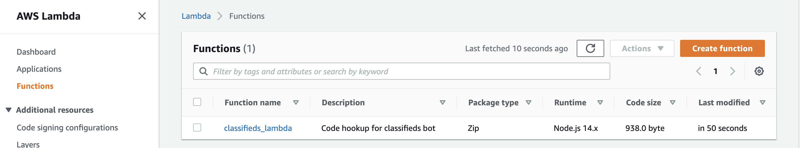
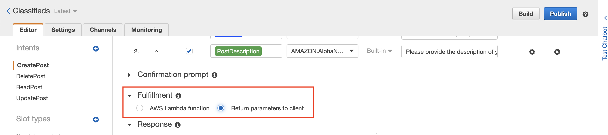
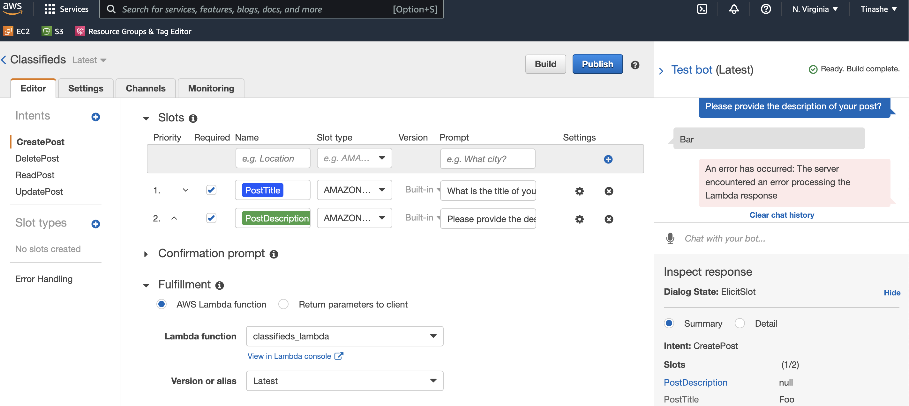
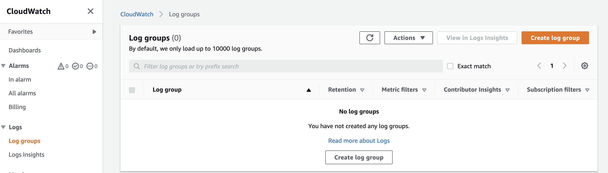
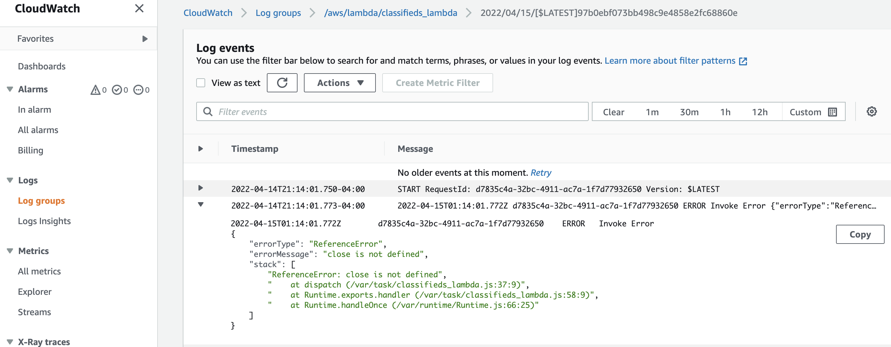

## Introducing AWS Lambda

> Lambda is a compute service that lets you run code without provisioning or managing servers. Lambda runs your code on a high-availability compute infrastructure and performs all of the administration of the compute resources, including server and operating system maintenance, capacity provisioning and automatic scaling, code monitoring and logging. With Lambda, you can run code for virtually any type of application or backend service. All you need to do is supply your code in one of the languages that Lambda supports.

You can see more on AWS Lambda at https://docs.aws.amazon.com/lambda/latest/dg/welcome.html

Earlier, you noticed that our bot returned the intent information on fulfillment. We will be using an AWS Lambda function as **code hook** for our Amazon Lex bot. Our function will perform validation and completion of our intent. In other words, we will use the Lambda function for business logic to fulfill our intents.

## Create Lambda function

You have a handful of runtime that you can pick to write your Lambda function. In our case, we are going to use nodejs. There is a lot of configuration required for our Lambda function. I will add comments to explain each piece of code.

### Source Code

First, let's write a little code for our function. Create a new directory named `src` within `aws-terraform-by-example`. Then create a file `classifieds_lambda.js` in the `src` directory.

```js
'use strict';

// --------------- Events -----------------------
function dispatch(intentRequest, context, callback) {
    const intentName = intentRequest.currentIntent.name;

    // map of slot names, configured for the intent, to slot values that
    // Amazon Lex has recognized in the user conversation.
    // A slot value remains null until the user provides a value.
    const slots = intentRequest.currentIntent.slots;

    // invocationSource indicates why Amazon Lex is invoking the Lambda function,
    // Amazon Lex sets this to one of the following values:
    // DialogCodeHook – Amazon Lex sets this value to direct the Lambda function
    // to initialize the function and to validate the user's data input.
    // FulfillmentCodeHook – Lex sets this value to
    // direct the Lambda function to fulfill an intent.
    const source = intentRequest.invocationSource;

    // Application-specific session attributes that the client
    // sends in the request.
    // If you want Amazon Lex to include them in the response to the client,
    // your Lambda function should send these back to Amazon Lex in the response
    const sessionAttributes = intentRequest.sessionAttributes;

    if (source !== 'DialogCodeHook') {
        callback(
            close(
                sessionAttributes,
                'Fulfilled',
                {
                    'contentType': 'PlainText',
                    'content': `Fulfill intent named ${intentName}
                    Body: ${JSON.stringify(slots)}`
                }
            )
        );
    }
}


// --------------- Main handler -----------------------

// Route the incoming request based on intent.
// The JSON body of the request is provided in the event slot.
exports.handler = (event, context, callback) => {
    try {
        dispatch(event,
            context,
            (response) => {
                callback(null, response);
            });
    } catch (err) {
        callback(err);
    }
};
```

### Terraform: Lambda function

Now that we have our code for Lambda let's work on the Terraform declaration of the function. First, create a new file `lambda.tf` and add the following code block.

```hcl
# The archive provider will expose resources to manage archive files.
provider "archive" {}

# This will generate an archive from our source file.
data "archive_file" "zip" {
  type = "zip"
  # source code path for our Lambda function which
  # handles Lex intent fulfillment activities
  source_file = "src/classifieds_lambda.js"
  # each time we have new changes in our code we send output to this
  # path as a zip
  output_path = "archives/classifieds.zip"
}

# The execution role provides the function's identity and
# access to AWS services and resources.
resource "aws_iam_role" "iam_for_classifieds_lambda" {
  name               = "iam_for_classifieds_lambda"
  assume_role_policy = data.aws_iam_policy_document.policy.json
}

#  ---- Data for our Lambda configuration ----

# The IAM policy that our Lambda execution role will assume
data "aws_iam_policy_document" "policy" {
  statement {
    sid    = ""
    effect = "Allow"

    principals {
      identifiers = ["lambda.amazonaws.com"]
      type        = "Service"
    }

    actions = ["sts:AssumeRole"]
  }
}

#  ----- End data for our configuration ---- //

resource "aws_lambda_function" "classifieds_lambda" {
  function_name = "classifieds_lambda"
  filename      = data.archive_file.zip.output_path
  # Amazon Resource Name (ARN) of the function's execution role.
  role = aws_iam_role.iam_for_classifieds_lambda.arn
  # Used to trigger updates. Must be set to a base64-encoded SHA256 hash
  # of the package file specified
  source_code_hash = filebase64sha256(data.archive_file.zip.output_path)

  handler     = "classifieds_lambda.handler"
  runtime     = "nodejs14.x"
  description = "Code hookup for classifieds bot"
}
```

Running `terraform apply` and you may run into the below error.

```txt
│ Error: Inconsistent dependency lock file
│
│ The following dependency selections recorded in the lock file are inconsistent with the current
│ configuration:
│   - provider registry.terraform.io/hashicorp/archive: required by this configuration but no version is selected
│
│ To update the locked dependency selections to match a changed configuration, run:
│   terraform init -upgrade
```

This is because we have added a new provider, `archive`, after initializing our Terraform dependencies. As the message suggests, we can address the issue by running `terraform init -upgrade`. After a successful upgrade, you can run the `apply` command again, and your Lambda function will be created. You can now navigate your AWS console to see the function and the deployed source code.




### Hooking function to intent

So we have created our Lambda function with business logic to fulfill our user intents. Unfortunately, we are not fulfilling our intents since we still return intent information in our lambda function as plain text.

```js
{
  'contentType': 'PlainText',
  'content': `Fulfill intent named ${intentName}
  Body: ${JSON.stringify(slots)}`
}
```

However, let's go ahead and hook the function to our intents. Our end goal is to have a lambda function selected in the section highlighted in the following image.



You could click on the radio button and select the lambda function, but then we will be diverging from our Terraform state, and our changes will be overwritten the next time we apply Terraform changes.

Head on to your file `lex_intents.tf`. I am starting with the `CreatePost` intent. Make the following update to `fulfillment_activity` block.

*aws-terraform-by-example/lex_intents.tf*

```hcl
  fulfillment_activity {
    type = "CodeHook"
    code_hook {
      message_version = 1.0
      uri             = aws_lambda_function.classifieds_lambda.arn
    }
  }
```

Instead of returning the intent, we are telling Lex that we will use a code hook in the form of a lambda function.

Run `terraform apply` and you will get an error similar to the following:

```bash
╷
│ Error: error updating intent CreatePost: BadRequestException: Lex is unable to access the Lambda function arn:aws:lambda:us-east-1:xxxxxxxxxx:function:classifieds_lambda in the context of intent arn:aws:lex:us-east-1:xxxxxxxxxx:intent:CreatePost:$LATEST.  Please check the resource-based policy on the function.
│
│   with aws_lex_intent.create_post,
│   on lex_intents.tf line 2, in resource "aws_lex_intent" "create_post":
│    2: resource "aws_lex_intent" "create_post" {
│
╵
```

We get this error because we haven't defined/specified a policy that allows Amazon Lex to access our Lambda function. Instead, AWS applies the principles of least privilege to resource access. When we don't specify an allow/deny statement policy, AWS will implicitly deny an authorization request.

::: tip
It's important to learn techniques for writing least privilege IAM policies. The following link provides more information on that https://aws.amazon.com/blogs/security/techniques-for-writing-least-privilege-iam-policies/
:::

Navigate to `lambda.tf` to address Lex authorization to use the lambda function

At the end of the file add the following block

*aws-terraform-by-example/lambda.tf*

```hcl
// ...

# Gives an external source Lex permission to access the Lambda function.
# We need our bot to be able to invoke a lambda function when
# we attempt to fulfill our intent.
resource "aws_lambda_permission" "allow_lex" {
  statement_id  = "AllowExecutionFromLex"
  action        = "lambda:InvokeFunction"
  function_name = aws_lambda_function.classifieds_lambda.function_name
  principal     = "lex.amazonaws.com"
}
```

Let's apply our changes by running the `apply` command

```bash
$ terraform apply
```

Now when you navigate to the bot's CreatePost intent, you will see that our lambda function is hooked on properly. However, when you test the bot, you will notice an error from our Lamda function. I intentionally introduced a bug when I created the function, and we will pretend that we don't know what the bug is. Instead, we will use Amazon CloudWatch logs to get insight into the issue.



### Introducing Amazon CloudWatch

Amazon CloudWatch is a monitoring and observability service that will provide us with data and actionable insights to monitor applications. For example, CloudWatch can detect issues with the environment, set alarms and logs, and visualize metrics.

Search for `CloudWatch` in the console to investigate our Lambda function's issue.



After navigating to `CloudWatch`, you will notice no logs from our Lambda function error. However, remember the principles of least privilege to resource access; AWS will not implicitly log errors for us without Lambda's permission.

```hcl
// ...
# We want to be able to send errors in our lambda function
# to CloudWatch logs
data "aws_iam_policy_document" "lambda_logs" {
  statement {
    sid    = ""
    effect = "Allow"
    actions = [
      # A log stream is a sequence of log events sharing the same source.
      "logs:CreateLogStream",
      # A log event is a record of some activity recorded by
      # the application or resource being monitored.
      "logs:PutLogEvents",
      # Log groups define groups of log streams sharing the same retention,
      # monitoring, and access control settings.
      # Each log stream has to belong to one log group
      "logs:CreateLogGroup"
    ]
    resources = ["*"]
  }
}

# Use the data defined above to create our IAM policy
resource "aws_iam_policy" "lambda_logs" {
  name        = "allow-logs-policy"
  description = "Allows access to logs"
  policy      = data.aws_iam_policy_document.lambda_logs.json
}

# Now that we have an iam policy, let's attach it to our lambda iam role
resource "aws_iam_role_policy_attachment" "lambda_logs_attach" {
  role       = aws_iam_role.iam_for_classifieds_lambda.name
  policy_arn = aws_iam_policy.lambda_logs.arn
}
```

Let's apply the changes by running `terraform apply`. Once applied, test the bot again in the console and navigate to `CloudWatch`. You should now see a Log group created, and clicking on the group; you should see logs similar to the following.



The issue is the `close` function that I intentionally omitted. Our Lambda function now has access to `CloudWatch` logs, and for any additional issues, we should be able to get some insights. So let's address the problem by updating our Lambda function.

*src/classifieds_lambda.js*

```js{3-14}
'use strict';

// Close dialog with the user,
// reporting fulfillmentState of Failed or Fulfilled
function close(sessionAttributes, fulfillmentState, message) {
    return {
        sessionAttributes,
        dialogAction: {
            type: 'Close',
            fulfillmentState,
            message,
        },
    };
}
// ...
```

Like always, run `terraform apply` to get changes reflected in our environment. After that, you can successfully test the bot and get plain text returned from our Lambda function.

Go ahead and update the three other intents to use the Lambda function for fulfillment. I have highlighted the new code additions.

*lex_intents.tf*

```hcl{1-4,10-14,22-26,36-40,48-52}
locals {
  fulfillment_activity_type = "CodeHook"
  message_version           = "1.0"
}

#  Intents - These are actions that the user wants to perfom
resource "aws_lex_intent" "create_post" {
  // ...
  fulfillment_activity {
    type = local.fulfillment_activity_type
    code_hook {
      message_version = local.message_version
      uri             = aws_lambda_function.classifieds_lambda.arn
    }
  }
 // ...
}

resource "aws_lex_intent" "read_post" {

  fulfillment_activity {
    type = local.fulfillment_activity_type
    code_hook {
      message_version = local.message_version
      uri             = aws_lambda_function.classifieds_lambda.arn
    }
  }
  // ...
}

// We will use Amazon Cognito later on to make sure the client
// is authorized to perform the update action
resource "aws_lex_intent" "update_post" {

  fulfillment_activity {
    type = local.fulfillment_activity_type
    code_hook {
      message_version = local.message_version
      uri             = aws_lambda_function.classifieds_lambda.arn
    }
  }
  // ...
}

resource "aws_lex_intent" "delete_post" {

  fulfillment_activity {
    type = local.fulfillment_activity_type
    code_hook {
      message_version = local.message_version
      uri             = aws_lambda_function.classifieds_lambda.arn
    }
  }
  //...
}
```

#### Local Values

You will notice I added a block with the keyword `locals`. In Terraform, a local value assigns a name to an expression, so you can use it multiple times within a module without repeating it. Therefore, we declared local values to avoid repeating/hardcoding the same values across our four intents.

