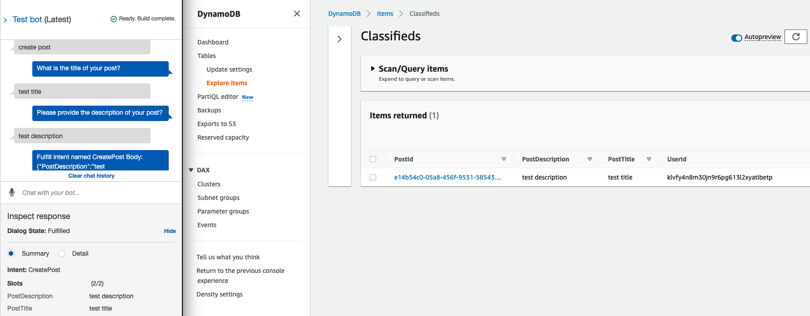
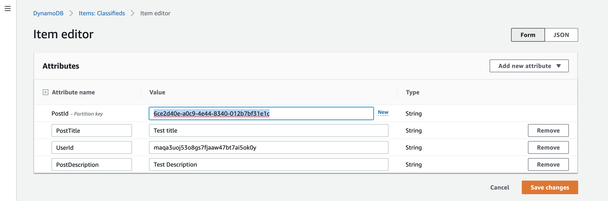
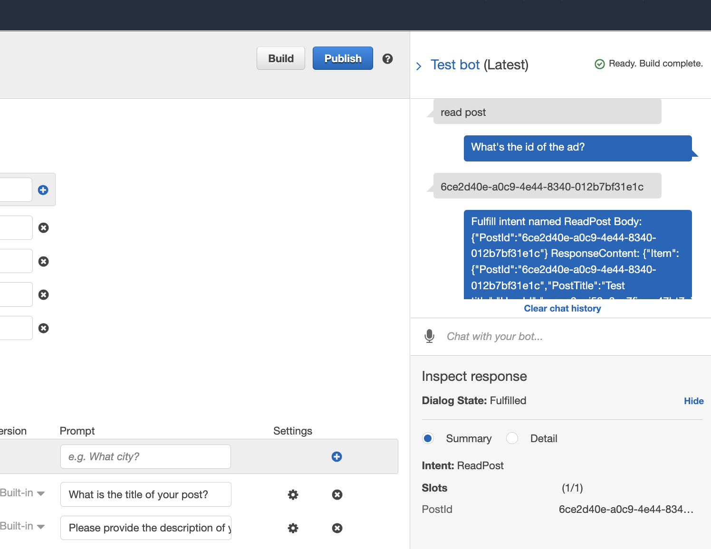

# Data storage

In the previous section we started implementing our business logic in a Lambda function, butwhat's a CRUD application without data storage? So our next task is tackling how we are going to store the classified ads that our users create via the chatbot. Our database of choice is going to be Amazon DynamoDB.

## Introducing Amazon DynamoDB

Amazon DynamoDB is a fully managed, serverless, key-value NoSQL database. It is designed to run high-peformance applications at any scale.

### Terraform: DyanamoDB

Create a new file `dynamodb.tf` in the root of your project and add the following:

```hcl
resource "aws_dynamodb_table" "classifieds" {
  name           = "Classifieds"
  read_capacity  = 20
  write_capacity = 20
  # Controls how you are charged for read
  # and write throughput and how you manage capacity.
  billing_mode = "PROVISIONED"
  hash_key     = "PostId"

  attribute {
    name = "PostId"
    type = "S"
  }
}
```

We have declared a DynamoDB table named `Classifieds`. We will use provisioned billing mode, so need read and write capacity specified ahead of time. Our hash key is going to be the post identifier `PostId`. Since this is a NoSQL database we don't necessarily have to specify additional attributes like `PostTitle` and `PostDescription`.

You can run `terraform plan` to see what will be provisioned. You should see output similar to below.

```hcl
Terraform used the selected providers to generate the following execution plan. Resource actions are
indicated with the following symbols:
  + create

Terraform will perform the following actions:

  # aws_dynamodb_table.classifieds will be created
  + resource "aws_dynamodb_table" "classifieds" {
      + arn              = (known after apply)
      + billing_mode     = "PROVISIONED"
      + hash_key         = "PostId"
      + id               = (known after apply)
      + name             = "Classifieds"
      + read_capacity    = 20
      + stream_arn       = (known after apply)
      + stream_label     = (known after apply)
      + stream_view_type = (known after apply)
      + tags_all         = (known after apply)
      + write_capacity   = 20

      + attribute {
          + name = "PostId"
          + type = "S"
        }

      + point_in_time_recovery {
          + enabled = (known after apply)
        }

      + server_side_encryption {
          + enabled     = (known after apply)
          + kms_key_arn = (known after apply)
        }

      + ttl {
          + attribute_name = (known after apply)
          + enabled        = (known after apply)
        }
    }

Plan: 1 to add, 0 to change, 0 to destroy
```

We don't have to provision the table just yet. Let's work on implementing our Lex intents one by one.

### CreatePost

```js
'use strict';

const AWS = require('aws-sdk');
const dynamodb = new AWS.DynamoDB.DocumentClient();
const TABLE_NAME = 'Classifieds'
const CREATE_POST_INTENT = 'CreatePost'

// Payload that we construct from intent slots
var payload = {}

// Close dialog with the user, reporting fulfillmentState of Failed or Fulfilled
function close(sessionAttributes, fulfillmentState, message) {
    return {
        sessionAttributes,
        dialogAction: {
            type: 'Close',
            fulfillmentState,
            message,
        },
    };
}

// --------------- Intents -----------------------
async function createPost(intentRequest, context, callback) {
    const slots = intentRequest.currentIntent.slots;
    const title = slots.PostTitle;
    const description = slots.PostDescription;

    payload = {
        PostId: context.awsRequestId,
        // we will update this to a real userId once we implement Cognito
        UserId: `${intentRequest.userId}`,
        PostTitle: title,
        PostDescription: description
    };
    await dynamodb
        .put({
            TableName: TABLE_NAME,
            Item: payload
        })
        .promise();
}

// --------------- Events -----------------------
function dispatch(intentRequest, context, callback) {
    const intentName = intentRequest.currentIntent.name;
    // ...

    switch (intentName) {
        case CREATE_POST_INTENT:
            createPost(intentRequest, context)
            break;
        default:
            throw new Error(`Intent with name ${intentName} not supported`);
    }

    // ...
}

// --------------- Main handler -----------------------

// ...
```

You can now run `terraform apply` to provision your resources. After provisioning the resources, testing the `CreatePost` intent you will get an error. You can check `CloudWatch` logs and will notice the following error:

```
"reason":{"errorType":"AccessDeniedException","errorMessage":"User:
arn:aws:sts::xxxxxxxxxx:assumed-role/iam_for_classifieds_lambda/classifieds_lambda
is not authorized to perform: dynamodb:PutItem
on resource: arn:aws:dynamodb:us-east-1:xxxxxxxxxx:table/Classifieds"...
```

By now we know the drill. We need to give our Lambda function permission to perform actions on our DynamoDB table.

Update `lambda.tf` and add the following code block at the end of the file.

```hcl
// ...

# We need to grant Lambda Dynamodb permissions
# So let's create an iam policy that allows operations on dynamodb
# Here we have specified all actions, however,
# it is recommended to specify only the required actions
data "aws_iam_policy_document" "allow_dynamodb" {
  statement {
    sid       = ""
    effect    = "Allow"
    actions   = [
        "dynamodb:PutItem"
    ]
    resources = ["*"]
  }
}

# Use the defined iam policy document to create an iam policy that allows dynamodb access
resource "aws_iam_policy" "allow_dynamodb" {
  name        = "allow-dynamodb-policy"
  description = "Allows access to dynamo db"
  policy      = data.aws_iam_policy_document.allow_dynamodb.json
}

# Now that we have an iam policy, let's attach it to our lambda iam role
resource "aws_iam_role_policy_attachment" "allow_dynamodb_attach" {
  role       = aws_iam_role.iam_for_classifieds_lambda.name
  policy_arn = aws_iam_policy.allow_dynamodb.arn
}
```

You can test the bot again and your post should be created and stored in DynamoDB.



### ReadPost

Let's work on the logic to read a post from our database. We will need to parse a `PostId` to our chatbot and it will return a post for us. Add logic to handle `ReadPost` intent as below.

```js {5,9-25,28,33-34,40-42,54-55}
'use strict';

// ...

const READ_POST_INTENT = 'ReadPost'

// ...

async function readPost(intentRequest, callback) {
    const slots = intentRequest.currentIntent.slots;

    var params = {
        TableName: TABLE_NAME,
        Key: {
            PostId: slots.PostId
        }
    };

    try {
        const result = await dynamodb.get(params).promise()
        return result;
    } catch (error) {
        console.error(error);
    }
}

// --------------- Events -----------------------
async function dispatch(intentRequest, context, callback) {
    const intentName = intentRequest.currentIntent.name;

    // ...

    // will store our response contet to be sent back to Lex
    let responseContent = ''

    switch (intentName) {
        case CREATE_POST_INTENT:
            createPost(intentRequest, context)
            break;
        case READ_POST_INTENT:
            responseContent = await readPost(intentRequest);
            break;
        default:
            throw new Error(`Intent with name ${intentName} not supported`);
    }

    if (source !== 'DialogCodeHook') {
        callback(
            close(
                sessionAttributes,
                'Fulfilled',
                {
                    'contentType': 'PlainText',
                    'content': `Fulfill intent named ${intentName}
                    ResponseContent: ${JSON.stringify(responseContent)}`
                }
            )
        );
    }
}
```

Apply your changes by running `terraform apply`.

Go ahead and create a new post using Lex test window. Navigate to DynamoDB and copy the created item's `PostId`. This process will use the scan process to return the items in the table.



::: warning
DynamoDB scans are expensive and slow. It's not good practice to use scans on your DynamoDB tables
:::

Now if you test reading a post using the test bot window you will get an error because Lambda has no DynamoDB `GetItem` permissions.

Update the `data "aws_iam_policy_document" "allow_dynamodb"` block in your `lambda.tf` file to the following.

```hcl{9-14}
# We need to grant Lambda Dynamodb permissions
# So let's create an iam policy that allows operations on dynamodb
# Here we have specified all actions, however,
# it is recommended to specify only the required actions
data "aws_iam_policy_document" "allow_dynamodb" {
  statement {
    sid       = ""
    effect    = "Allow"
    actions   = [
        "dynamodb:PutItem",
        "dynamodb:UpdateItem",
        "dynamodb:GetItem",
        "dynamodb:DeleteItem"
    ]
    resources = ["*"]
  }
}
```

Apply the new IAM policy by running `terraform apply`.

Test the intent again and you should see a successful response.




### UpdatePost

Next up is the logic for the update intent. For now, we won't worry about authentication and authorization as we will address that later when we look at Amazon Cognito.

Make the following updates to `src/classifieds_lambda.js`

```js{3,7-17,24-26}
'use strict';
// ...
const UPDATE_POST_INTENT = 'UpdatePost'

// ...

async function updatePost(intentRequest) {
    const slots = intentRequest.currentIntent.slots;
    payload = {...slots};

    await dynamodb
        .put({
            TableName: TABLE_NAME,
            Item: payload,
        })
        .promise();
}

// --------------- Events -----------------------
async function dispatch(intentRequest, context, callback) {
// ...
    switch (intentName) {
        // ...
        case UPDATE_POST_INTENT:
            responseContent = await updatePost(intentRequest);
            break;
        default:
            throw new Error(`Intent with name ${intentName} not supported`);
    }
}
```

Apply the changes by running `terraform apply`. When you try to test the bot you will notice that after providing the `PostId` the intent is fulfilled right away. The reason is because Amazon Lex will not implicityly prompt for slots that are not marked as required. If you look back on our definition of `UpdateIntent` you will see that we have both slots set as not required. It would be bad for Lex to make assumptions as you may have other cases where you want to ignore the slots.

Let's make updates to check for empty optional slots and prompt the user to provide the information.

```js{4,5,10-25}
    //...
    // will store our response contet to be sent back to Lex
    let responseContent = ''
    let slotToElicit;
    let message;

    switch (intentName) {
        // ...
        case UPDATE_POST_INTENT:
            // check for optional slots and prompt user input
            if (!intentRequest.currentIntent.slots.PostTitle) {
                slotToElicit = 'PostTitle'
                message = 'Enter a new title of your post. Enter 0 to keep existing title.'
                return callback(
                    elicitSlot(sessionAttributes, intentName, slots, slotToElicit, message)
                );
            }

            if (!intentRequest.currentIntent.slots.PostDescription) {
                slotToElicit = 'PostDescription'
                message = 'Enter new description of your post. Enter 0 if you want to keep existing description.'
                return callback(
                    elicitSlot(sessionAttributes, intentName, slots, slotToElicit, message)
                );
            }

            responseContent = await updatePost(intentRequest);
            break;
        default:
            throw new Error(`Intent with name ${intentName} not supported`);
    }

    //...
```

Apply the changes and test again. You are now prompted to provide title and description of your post. What if you want to change one slot only? We have added an option to provide a response of zero when we want to maintain existing changes. However, if we try using that option our attributes are updated with zero values. So let's add checks for that. See highlighted changes next.

```js{3-5,7-18}
async function updatePost(intentRequest) {
    const slots = intentRequest.currentIntent.slots;
    payload = {
        PostId: slots.PostId
    }

    // no updates to make
    if (slots.PostTitle == 0 && slots.PostDescription == 0) {
        return;
    }

    if (slots.PostTitle != 0) {
        payload.PostTitle = slots.PostTitle
    }

    if (slots.PostDescription != 0) {
        payload.PostDescription = slots.PostDescription
    }

    // ...
}
```

After aplying the changes with `terraform appply`, test the bot again. You will notice that if you respond to keep an existing attribute value, DynamoDb is going to remove the attribute because we are using a `PutItem` operation. The `PutItem` operation completely overwrites an existing Item in the table, meaning if we don't provide the existing attributes, we won't have them after the operation.

Instead, we would like to modify the existing Item and keep other attributes untouched. To achieve this we will use the `UpdateItem` operation, which our DynamoDb JavaScript client delegates via its `update` method. With the `UpdateItem` operation we are going to need to provide an **update expression** - an update expression specifies how `UpdateItem` will modify the attributes of an item. 

Lets make changes to our lambda function to see how that will look.

```js{3-5,13-14,18-19,22-31,35}
async function updatePost(intentRequest) {
    const slots = intentRequest.currentIntent.slots;
    payload = {}
    let updateExpression = `SET`
    let updateExpressionActions = []

    // no updates to make
    if (slots.PostTitle == 0 && slots.PostDescription == 0) {
        return;
    }

    if (slots.PostTitle != 0) {
        payload[`:PostTitle`] = slots.PostTitle
        updateExpressionActions.push(" PostTitle = :PostTitle")
    }

    if (slots.PostDescription != 0) {
        payload[`:PostDescription`] = slots.PostDescription
        updateExpressionActions.push(" PostDescription = :PostDescription")
    }

    let params = {
        TableName: TABLE_NAME,
        Key: {
            PostId: slots.PostId
        },
        // example: SET PostTitle = :PostTitle, PostDescription = :PostDescription 
        UpdateExpression: updateExpression + updateExpressionActions.join(", "),
        ExpressionAttributeValues: payload,
        // don't create a new item if it doesn't exist
        ConditionExpression: 'attribute_exists(PostId)',
      };

    await dynamodb
        .update(params)
        .promise();
}
```

Lets talk about the updates we have made. In our `UpdateExpression` we have used `SET` - an action to add one or more attributes to an item. Any attributes that already exists will be overwritten by the new values.

We have also added a `ConditionExpression` that checks whether the provided `PostId` exists. On updates, DynamoDb will create a new Item if the provided Item does not exist. This is not what we want for our use case. If the condition check fails, an exception will be thrown. We will handle more exceptions later on.

Apply the changes and testing updates should work fine now.

### DeletePost

Moving on to `DeletePost` intent. This should be an easy one. Add the highlighted logic and apply your changes by running `terraform apply`.

```js{4,8-20,27-29}
'use strict';

// ...
const DELETE_POST_INTENT = 'DeletePost'

// ...

async function deletePost(intentRequest) {
    const slots = intentRequest.currentIntent.slots;
    let params = {
        TableName: TABLE_NAME,
        Key: {
            PostId: slots.PostId
        },
    };

    return await dynamodb
        .delete(params)
        .promise();
}

// --------------- Events -----------------------
async function dispatch(intentRequest, context, callback) {
    // ...
    switch (intentName) {
        // ...
        case DELETE_POST_INTENT:
            responseContent = await deletePost(intentRequest);
            break;
        default:
            throw new Error(`Intent with name ${intentName} not supported`);
    }
}
```
