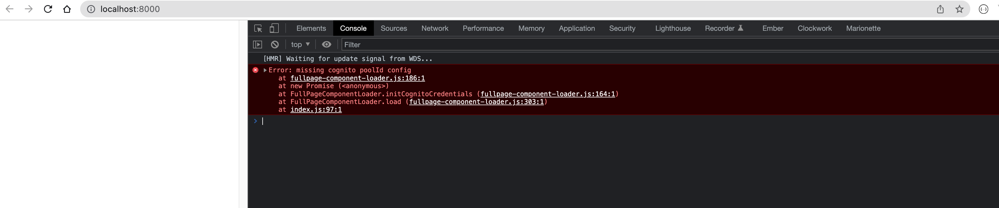
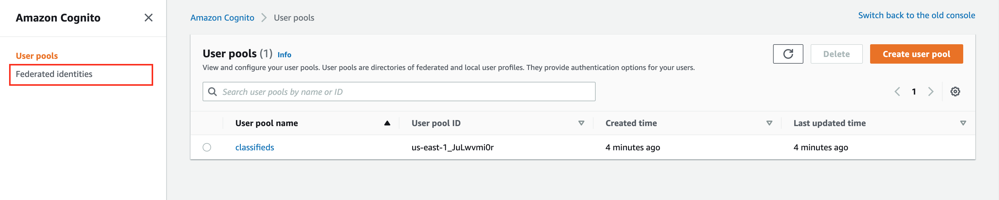
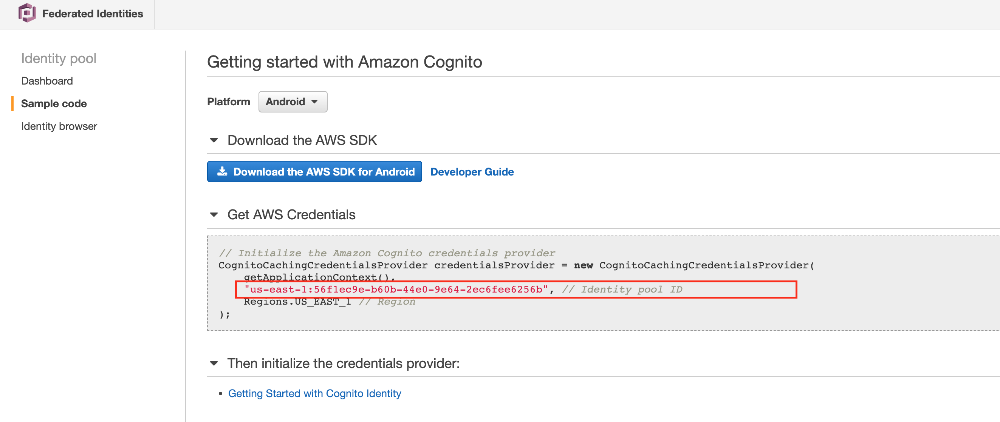
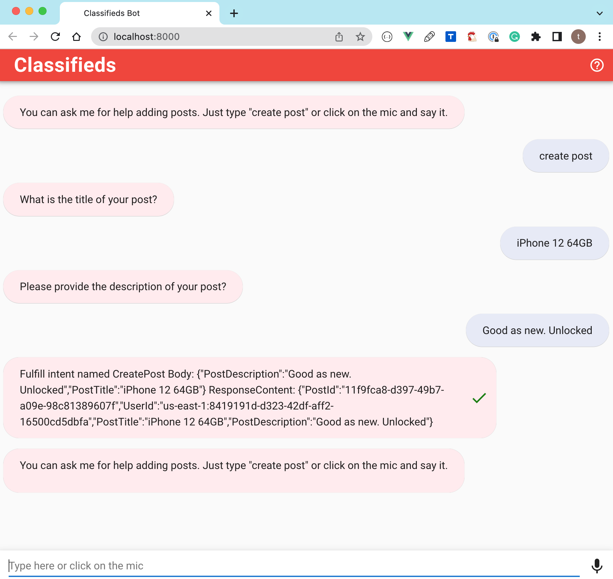

# Chatbot Web Interface

## Chatbot UI

Until now, we have been interacting with our chatbot using the bot test window in the console. However, we would like our users to interact with the chatbot on the web. Luckily we don't have to build the UI from scratch. Instead, Amazon has a sample Lex Web UI project that we can leverage. We will use the sample project for our use case and reduce development time.

The chatbot UI has a lot of benefits that include:

- Mobile-ready responsive UI
- Support for voice and text
- Fully integrated user login via Amazon Cognito User Pool (we will use this for authentication and authorization)
- Resending any previous messages

These are just some benefits, but there is more, as we will see when we start working on the integration.

Let's pull the sample code into our project. Then, run the following command in your project's `src` directory.

```bash
$ git clone https://github.com/aws-samples/aws-lex-web-ui.git
```

Remove the remote origin from the clone repo

```bash
$ cd aws-lex-web-ui && git remote remove origin && rm -rf .git
```

We have the following options for deploying and integrating the chatbot UI:

1. Using AWS CloudFormation
2. Using a prebuilt distribution library
3. Using a prepackaged component

We are going to use the last option. We will be able to test on our local machine and deploy to Amazon s3 later.

Let's test the sample we just pulled in by navigating to the chatbot UI directory.

While in the `aws-lex-web-ui` directory, install node dependencies.

```bash
$ npm ci
```

Build and run the project

```bash
$ npm run build && npm run dev
```

You should see output similar to the following:

```text
> aws-lex-web-ui@0.19.4 dev
> webpack-dev-server --mode development  --hot

ℹ ｢wds｣: Project is running at http://localhost:8000/
ℹ ｢wds｣: webpack output is served from /
```

You will encounter a blank screen when you navigate the above URL. If you check the browser developer console, you will notice the following error `Error: missing cognito poolId config`



We are getting this error because chatbot UI leverages Amazon Cognito for authentication and authorization.

## Introducing Amazon Cognito

Amazon Cognito provides authentication, authorization, and user management for web and mobile apps. Our users can sign in directly with a user name and password or via a third party such as Facebook, Amazon, Google, or Apple.

Amazon Cognito has two primary components - **user pools** and **identity pools**. User pools are user directories that provide us with sign-up and sign-in options. Identity pools afford us to grant users access to other AWS services. So from the previous error, `Error: missing cognito poolId config`, chatbot UI is missing configuration for an **identity pool**.

Let's work on creating Cognito resources using Terraform.
Create a new file `cognito.tf` in the root of your project.

```hcl
resource "aws_cognito_identity_pool" "main" {
  identity_pool_name               = "classifieds"
  // for now we will allow unauthenticated users for testing
  allow_unauthenticated_identities = true
  allow_classic_flow               = false
}

# IAM role to use with authenticated identities
resource "aws_iam_role" "authenticated" {
  name = "cognito_authenticated"

  assume_role_policy = <<EOF
{
  "Version": "2012-10-17",
  "Statement": [
    {
      "Effect": "Allow",
      "Principal": {
        "Federated": "cognito-identity.amazonaws.com"
      },
      "Action": "sts:AssumeRoleWithWebIdentity",
      "Condition": {
        "StringEquals": {
          "cognito-identity.amazonaws.com:aud": "${aws_cognito_identity_pool.main.id}"
        },
        "ForAnyValue:StringLike": {
          "cognito-identity.amazonaws.com:amr": "authenticated"
        }
      }
    }
  ]
}
EOF
}

// Policy to use with authenticated identities
resource "aws_iam_role_policy" "authenticated" {
  name = "authenticated_policy"
  role = aws_iam_role.authenticated.id

  policy = <<EOF
{
  "Version": "2012-10-17",
  "Statement": [
    {
      "Effect": "Allow",
      "Action": [
        "mobileanalytics:PutEvents",
        "cognito-sync:*",
        "cognito-identity:*",
        "lex:PostContent",
        "lex:PostText",
        "lex:PutSession",
        "lex:GetSession",
        "lex:DeleteSession",
        "lex:RecognizeText",
        "lex:RecognizeUtterance",
        "lex:StartConversation"
      ],
      "Resource": [
        "*"
      ]
    }
  ]
}
EOF
}

resource "aws_cognito_identity_pool_roles_attachment" "main" {
  identity_pool_id = aws_cognito_identity_pool.main.id

  roles = {
    "authenticated"   = aws_iam_role.authenticated.arn,
    "unauthenticated" = aws_iam_role.unauthenticated.arn
  }
}

resource "aws_iam_role" "unauthenticated" {
  name = "cognito_unauthenticated"

  assume_role_policy = <<EOF
{
  "Version": "2012-10-17",
  "Statement": [
    {
      "Effect": "Allow",
      "Principal": {
        "Federated": "cognito-identity.amazonaws.com"
      },
      "Action": "sts:AssumeRoleWithWebIdentity",
      "Condition": {
        "StringEquals": {
          "cognito-identity.amazonaws.com:aud": "${aws_cognito_identity_pool.main.id}"
        },
        "ForAnyValue:StringLike": {
          "cognito-identity.amazonaws.com:amr": "unauthenticated"
        }
      }
    }
  ]
}
EOF
}

resource "aws_iam_role_policy" "unauthenticated" {
  name = "unauthenticated_policy"
  role = aws_iam_role.unauthenticated.id

  policy = <<EOF
{
  "Version": "2012-10-17",
  "Statement": [
    {
      "Effect": "Allow",
      "Action": [
        "mobileanalytics:PutEvents",
        "cognito-sync:*",
        "lex:PostContent",
        "lex:PostText",
        "lex:PutSession",
        "lex:GetSession",
        "lex:DeleteSession",
        "lex:RecognizeText",
        "lex:RecognizeUtterance",
        "lex:StartConversation"
      ],
      "Resource": [
        "*"
      ]
    }
  ]
}
EOF
}

resource "aws_cognito_user_pool" "classifieds" {
  name             = "classifieds"
  alias_attributes = ["email", "phone_number"]
}
```

Run `terraform apply` to provision your new resources.


You can obtain your pool id from Terraform output as seen next:

```bash
...
aws_cognito_user_pool.classifieds: Creating...
aws_cognito_identity_pool.main: Creation complete after 0s [id=us-east-1:a1e0d5a9-e1f4-4bbf-b383-cf92aa462b5b]
...
```

You can also use `terraform console`

```txt
bash-3.2$ terraform console
> resource.aws_cognito_identity_pool.main
{
  "allow_classic_flow" = false
  "allow_unauthenticated_identities" = true
  "arn" = "arn:aws:cognito-identity:us-east-1:082920454967:identitypool/us-east-1:a1e0d5a9-e1f4-4bbf-b383-cf92aa462b5b"
  "cognito_identity_providers" = toset([])
  "developer_provider_name" = ""
  "id" = "us-east-1:a1e0d5a9-e1f4-4bbf-b383-cf92aa462b5b"
  "identity_pool_name" = "classifieds"
  "openid_connect_provider_arns" = toset(null) /* of string */
  "saml_provider_arns" = tolist(null) /* of string */
  "supported_login_providers" = tomap(null) /* of string */
  "tags" = tomap(null) /* of string */
  "tags_all" = tomap({})
}
>
```

Alternatively, you can find the pool id in the AWS console. Navigate to the AWS console and search for **Cognito**. You should see a link to **Federated identities**



Click through the link and look for your identity pool, copy the identity pool id.



It's ok for this identity pool id to be in your HTML or JavaScript files. However, as additional security, we will restrict our pool to authenticated users only later.


## Configure Chatbout UI

Chatbot UI provides us with some default configurations, which you can find in the file  `src/aws-lex-web-ui/src/config/default-lex-web-ui-loader-config.json`. Then, we will override or add our own configuration to `src/aws-lex-web-ui/src/config/lex-web-ui-loader-config.json`.

Make the following updates to `lex-web-ui-loader-config.json`.

```json
{
  "region": "us-east-1",
  "cognito": {
    "poolId": "us-east-1:a1e0d5a9-e1f4-4bbf-b383-cf92aa462b5b",
    "aws_cognito_region": "us-east-1",
    "region": "us-east-1"
  },
  "lex": {
    "botName": "Classifieds",
    "initialText": "You can ask me for help adding posts. Just type \"create post\" or click on the mic and say it.",
    "initialSpeechInstruction": "Say 'Create Post' to get started.",
    "initialUtterance": "",
    "region": "us-east-1"
  },
  "ui": {
    "parentOrigin": "http://localhost:8000",
    "toolbarTitle": "Classifieds",
    "pageTitle": "Order Flowers Bot",
    "toolbarLogo": "",
    "positiveFeedbackIntent": "Thumbs up",
    "negativeFeedbackIntent": "Thumbs down",
    "helpIntent": "Help",
    "helpContent": {}
  },
  "iframe": {
    "iframeOrigin": "",
    "shouldLoadIframeMinimized": false,
    "iframeSrcPath": "/index.html#/?lexWebUiEmbed=true"
  }
}
```

Rebuild the app again and navigate to the provided URL on your machine.



The next thing we will cover is how we can use a cloud-based integrated development environment  (IDE). The approach has a lot of benefits that we will cover. We will continue building our application after setting up the cloud-based integrated development environment.

::: danger  Destroy environment
Go ahead and run `terraform destroy` on your local machine.

We want to ensure that when we start with Cloud9 we don't have any resources left over since we will be switching how we track our Terraform state.
:::

## Terraform Backend Configuration

Before moving on to **Cloud9**, let's talk about Terraform Backend Configuration. We have been maintaining our Terraform state on our local machine. However, this won't scale in a collaborative environment. Instead, we can specify a backend that defines where Terraform stores its state data files.

A backend defines where Terraform stores its state data files. For example, we can change from the default `local` backend to an `s3` backend.

[Learn more on Terraform Backend Configuration](https://www.terraform.io/language/settings/backends/configuration)


`providers.tf`

```hcl{9-13}
terraform {
  required_providers {
    aws = {
      source  = "hashicorp/aws"
      version = "~> 4.8"
    }
  }

  backend "s3" {
    bucket = "terraform-state-aws-by-example"
    key    = "main/terraform.tfstate"
    region = "us-east-1"
  }
}

provider "aws" {
  region  = var.aws_region
  profile = "aws-terraform-example"
}
```

Attempt to run terraform commands, and you will encounter an error because you have to re-initialize Terraform each time you switch the backend.

```
╷
│ Error: Backend initialization required, please run "terraform init"
│
│ Reason: Initial configuration of the requested backend "s3"
```

Running `terraform init` command

```
Initializing the backend...
╷
│ Error: Failed to get existing workspaces: S3 bucket does not exist.
│
│ The referenced S3 bucket must have been previously created. If the S3 bucket
│ was created within the last minute, please wait for a minute or two and try
│ again.
│
```

So make sure to head to the AWS console, create a unique bucket (must be unique across all bucket names in AWS), and re-run the init command.