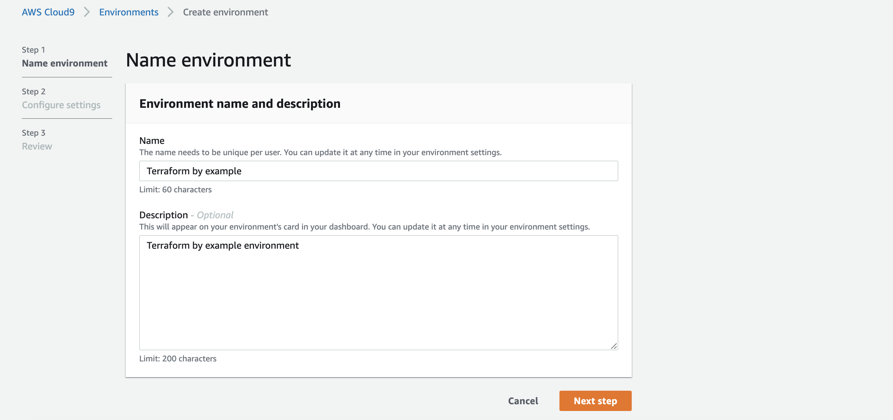
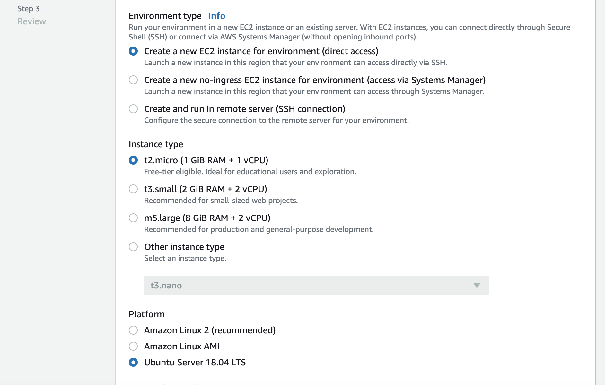
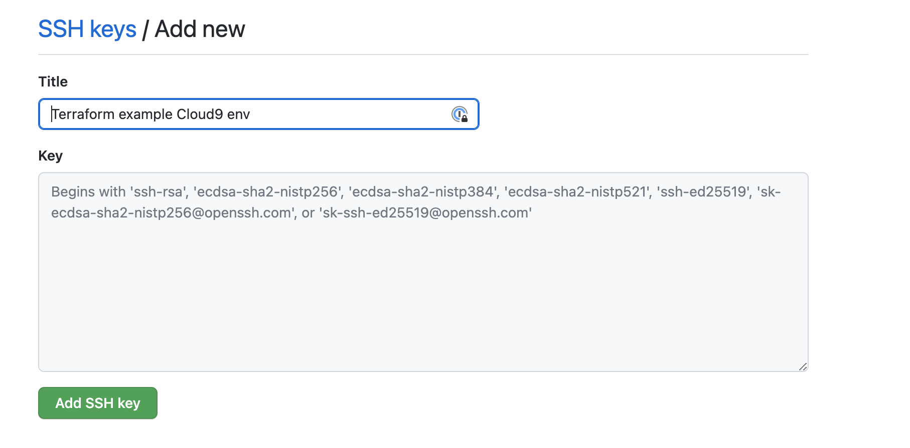
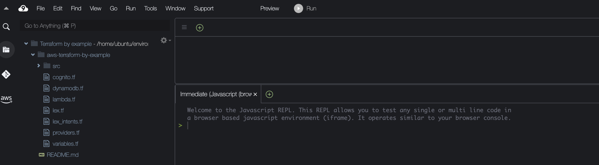

# Introducing AWS Cloud9

Until now, we have been using VSCode IDE on our local machine. While this allows for a faster and easier setup, there are some drawbacks. For instance, we have to set up AWS access keys and secrets. Now imagine in a collaborative environment, we will need each team member to set up AWS credentials which may not be ideal. As an alternative, we can use AWS Cloud9.

## What is AWS Cloud9

AWS Cloud9 is a cloud-based integrated development environment (IDE) that allows you to write, run and debug code via the browser. Like VSCode, it encompasses a code editor, debugger, and terminal. You can work on your project from anywhere, as long as you have a machine connected to the internet. In addition, sharing development environments and code pairing with team members is a breeze. 

> Also, AWS Cloud9 comes with a terminal that includes sudo privileges to the managed Amazon EC2 instance hosting your development environment and a preauthenticated AWS Command Line Interface. This makes it easy for you to run commands quickly and directly access AWS services.


## Cloud9 Setup

### Create environment

1. Navigate to your AWS console and search for Cloud9
2. Click on the **Create environment** button
3. Provide a name for your environment



4. Click next and make sure to select at least the following settings just to make sure we work with the same settings



5. Proceed with all the remaining steps and create your environment. Creation process may take a few minutes.

### Git setup

Next, we need to pull in our code from a code repository. In my case, I'm using GitHub, so my instructions will be more specific towards GitHub.

**Clone code repository**

AWS Cloud9 **EC2** environments come preinstalled with Git. Trying cloning the repository that has your work to this point, you will get permissions issues.

```bash
ubuntu:~/environment $ git clone git@github.com:musonza/aws-terraform-by-example.git
Cloning into 'aws-terraform-by-example'...
git@github.com: Permission denied (publickey).
fatal: Could not read from remote repository.

Please make sure you have the correct access rights
and the repository exists.
```

**GitHub setup for ssh access**

While in your Cloud9 terminal, run the following commands

1. Generate RSA key pair

```bash
$ ssh-keygen -t rsa
```

Hit enter on all steps until you get 

```txt
ubuntu:~/environment $ ssh-keygen -t rsa
Generating public/private rsa key pair.
Enter file in which to save the key (/home/ubuntu/.ssh/id_rsa): 
Enter passphrase (empty for no passphrase): 
Enter same passphrase again: 
Your identification has been saved in /home/ubuntu/.ssh/id_rsa.
Your public key has been saved in /home/ubuntu/.ssh/id_rsa.pub.
The key fingerprint is: ...
```

3. Copy your Public Key to your GitHub account

In your Cloud9 terminal, run `cat /home/ubuntu/.ssh/id_rsa.pub` to output the public key. You should see output similar to the following:

```bash
ubuntu:~/environment $ cat /home/ubuntu/.ssh/id_rsa.pub 
ssh-rsa AAAAB3NzaC1yc2EAAAADAQABAAABAQDRgHEFukDcGGJVoUgaR21u1deG0ujJdar5fp7Kcw4zEOoZCD/VoZpOAB7/VSEF9qpXpqqZIbFBNzbTG92KNF+VKOlzH8CoURlDMCtsUlRH6LVljdUcu6PnStXNsUnVYruVfJLgh1jEK8+jO64OEa9agdZyopH/DWx3DOzIlx2CddYU8Nz..
```

- Go to your https://github.com/settings/keys page and click **New SSH key** 



4. Try cloning the repo again and you should be successful

::: tip
Make sure you are cloning via ssh repository URL and not https. 

For example `git clone git@github.com:musonza/aws-terraform-by-example.git` vs 
`git clone https://github.com/musonza/aws-terraform-by-example.git`
:::





### Terraform init

Cloud9 environment also comes with Terraform preinstalled.

1. Run `terraform init` command since we are starting fresh with the environment

Make sure you are in the root of your cloned project.

```bash
ubuntu:~/environment/aws-terraform-by-example (master) $ terraform init

Initializing the backend...

Initializing provider plugins...
- Reusing previous version of hashicorp/archive from the dependency lock file
- Reusing previous version of hashicorp/aws from the dependency lock file
- Installing hashicorp/archive v2.2.0...
- Installed hashicorp/archive v2.2.0 (signed by HashiCorp)
- Installing hashicorp/aws v4.13.0...
- Installed hashicorp/aws v4.13.0 (signed by HashiCorp)

Terraform has been successfully initialized!
```

2. Run `terraform plan` to check the resources that will be provisioned.

You will get the following error.

```bash
ubuntu:~/environment/aws-terraform-by-example (master) $ terraform plan
data.archive_file.zip: Reading...
data.archive_file.zip: Read complete after 0s [id=3709e7b0ae2aafe3ab6e1f48c4de94b36a0bd4a6]
╷
│ Error: error configuring Terraform AWS Provider: failed to get shared config profile, aws-terraform-example
│ 
│   with provider["registry.terraform.io/hashicorp/aws"],
│   on providers.tf line 10, in provider "aws":
│   10: provider "aws" {
│ 
╵
ubuntu:~/environment/aws-terraform-by-example (master) $
```

Remember, on the local machine; we used an AWS credentials profile to enable Terraform to access our AWS resources. However, with Cloud9, we don't need that anymore because the terminal includes sudo privileges to the managed Amazon EC2 instance that hosts our development environment.

Remove `profile = "aws-terraform-example"` from the `aws` provider in `providers.tf`. Your file should look as following:

`providers.tf`

```hcl
terraform {
  required_providers {
    aws = {
      source  = "hashicorp/aws"
      version = "~> 4.8"
    }
  }
}

provider "aws" {
  region  = var.aws_region
}
```

- Running `terraform plan` should succeed now.

3. Now run `terraform apply` command.

You may get errors similar to

```bash
│ Error: failed creating IAM Role (cognito_authenticated): InvalidClientTokenId: The security token included in the request is invalid
│       status code: 403, request id: cce545a5-25ae-4a65-a73f-ae029e1baa4d
│ 
│   with aws_iam_role.authenticated,
│   on cognito.tf line 9, in resource "aws_iam_role" "authenticated":
│    9: resource "aws_iam_role" "authenticated" {
```